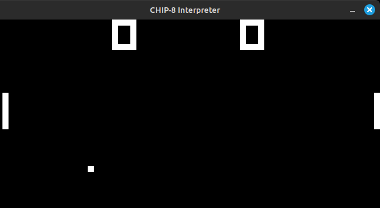
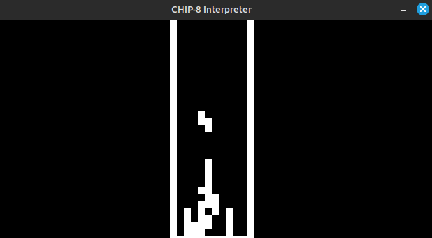
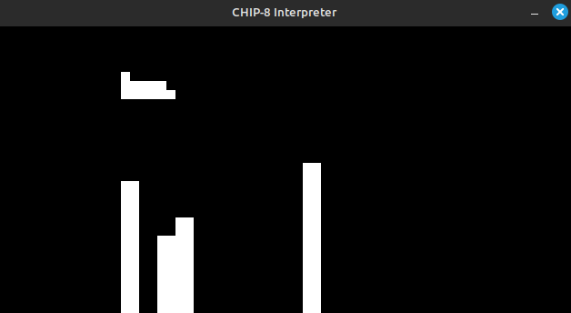

# CHIP-8 Emulator/Interpreter

[](https://github.com/jwt2706/Chip8Interpreter/actions/workflows/gcc.yml)

This is a CHIP-8 interpreter, built with SDL2. It mimics the CHIP-8 system and includes emulation for the COSMAC VIP hexadecimal keyboard layout. It's still not complete, but works enough to load some ROMs and play a bit.

[What is CHIP-8?](https://wikipedia.org/wiki/CHIP-8)

Screenshots (Pong/Tetris/Blitz):

  

## Setup

### Prerequisites

This project is dependant on the **SDL2 library**. Please make sure you lookup how to install it for your system before continuing.

### Installation

1. Download the latest version from the [releases tab](https://github.com/jwt2706/Chip8Interpreter/releases/latest) and place it in a directory of your choice.

2. Create a `roms` directory in the same directory as the executable. This is where you'll place the CHIP-8 ROM files.

3. Place your CHIP-8 ROM files in the `roms` directory.

### Usage

1. Open a terminal in the same directory as the CHIP-8 Interpreter.

2. Run the following: `./Chip8Interpreter <name of the ROM> <delay>`. The deplay parameter is optionnal, it's only there because some games seem to work better at different speeds. So just try, and see what works. The default is 2 miliseconds.

### Controls

The original COSMAC VIP had a 4x4 hexadecimal keyboard, which I mapped as the following (on a QWERTY keyboard):

```
1 2 3 4
Q W E R
A S D F
Z X C V
```

Other keyboard layouts should also work with the same key placements.<br>
About the controls for the actual games, it's always different... just trial and error I guess, or you can look them up.

## Compile from source

I'm not going to write instructions on how to compile from source because I figure if you're trying to do this, you alreay know what you are doing. :)

## Acknowledgements

[This general high-level guide](https://tobiasvl.github.io/blog/write-a-chip-8-emulator) is what got me into making this. It was a lot of fun! I suggest you try making one too.
